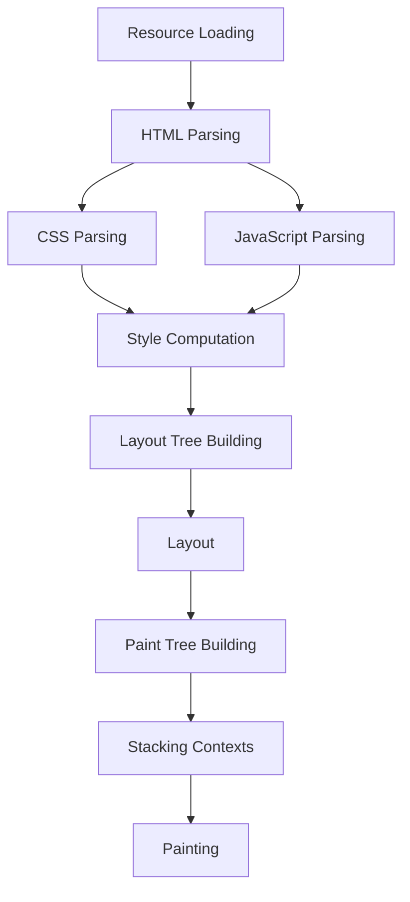

LibWeb is Ladybird's HTML/CSS rendering engine. This document walks through the complete pipeline from loading a web page to painting pixels on screen.

<Note>
This document is a work in progress. More details about each stage will be added over time.
</Note>

## Pipeline overview

The LibWeb rendering pipeline consists of several sequential stages:



Let's explore each stage in detail.

## Resource loading

The pipeline begins when a URL needs to be loaded.

<Info>
LibWeb makes an IPC call to **RequestServer**, asking it to start loading the requested URL.
</Info>

The RequestServer process handles:

- DNS resolution via LookupServer
- HTTP/HTTPS protocol handling
- Response header parsing
- Streaming response data back to WebContent

See [Process architecture](/architecture/process-architecture) for more details on RequestServer.

## HTML parsing

The HTML parser transforms an input stream into a DOM tree.

### Parser responsibilities

- Determine character encoding
- Tokenize the HTML input
- Build the DOM tree structure
- Handle malformed HTML gracefully

<Warning>
For historical reasons, HTML parsing is unusually complicated compared to other data formats.
</Warning>

### Implementation details

LibWeb implements the HTML tokenization and parsing algorithms as specified in the HTML standard:

- The **tokenizer** and **parser** are separate but deeply interconnected
- They reach into each other and update state in certain situations
- The parser must handle the `document.write()` API, which allows JavaScript to inject input

### Programmatic injection

```javascript
// JavaScript can inject content during parsing
document.write('<div>Injected content</div>');
```

The document being parsed may run JavaScript, and this JavaScript may indirectly interact with the parser by feeding it override inputs.

<Tip>
The HTML parser is highly resilient and can recover from syntax errors, which is why broken HTML still renders in browsers.
</Tip>

## CSS parsing

As stylesheets are encountered, the CSS parser processes them.

### CSS parser responsibilities

- Tokenize CSS syntax
- Build the CSSOM (CSS Object Model)
- Handle syntax errors gracefully
- Preserve unresolved values with variables

<Info>
CSS values containing variables (custom properties) cannot be resolved until the cascade runs. These are kept as "unresolved" values.
</Info>

### CSS object model

The parser builds a structured representation:

- **Stylesheets**: Collection of rules
- **Rules**: Selectors and declarations
- **Declarations**: Property-value pairs
- **Values**: Typed CSS values (lengths, colors, etc.)

## JavaScript parsing and execution

When `<script>` tags are encountered, LibJS takes over.

### JavaScript pipeline

1. **JS parser**: Tokenizes and parses JavaScript source
2. **AST builder**: Constructs an Abstract Syntax Tree
3. **Interpreter**: Executes the AST
4. **Garbage collector**: Reclaims unused memory (mark & sweep)

### Execution model

```javascript
// JavaScript can modify the DOM
document.getElementById('content').textContent = 'Updated!';

// And trigger style recalculation
element.style.color = 'red';
```

<Warning>
JavaScript execution can trigger re-parsing, style recalculation, and layout - potentially multiple times during page load.
</Warning>

## Style computation

Style computation determines which CSS values apply to each DOM element.

### Selector matching

A CSS selector is represented by the `CSS::Selector` class.

Given this selector:

```css
#foo .bar.baz > img
```

LibWeb creates this object tree:

```cpp
CSS::Selector
  * CSS::CompoundSelector (combinator: ImmediateChild)
    * CSS::SimpleSelector (type: TagName, value: img)
  * CSS::CompoundSelector (combinator: Descendant)
    * CSS::SimpleSelector (type: Class, value: bar)
    * CSS::SimpleSelector (type: Class, value: baz)
  * CSS::CompoundSelector (combinator: None)
    * CSS::SimpleSelector (type: ID, value: foo)
```

<Tip>
Selectors are evaluated **right-to-left**, looking for the first opportunity to reject the match. This optimization makes selector matching much faster.
</Tip>

### Optimization: selector bucketing

LibWeb minimizes the number of selectors evaluated for each element using a **bucketing cache** in StyleComputer.

Rules are divided into buckets based on their rightmost complex selector:

- A selector matching class `foo` is only evaluated against elements with class `foo`
- A selector matching tag `div` is only evaluated against `<div>` elements
- Universal selectors (`*`) must be evaluated against all elements

### The CSS cascade

> The C in CSS is for "cascading"

The cascade determines the final property values by evaluating all applicable CSS declarations in order.

**Cascade order factors:**

1. **Origin**: User-agent → author → user
2. **Importance**: Normal → `!important`
3. **Specificity**: ID > class > tag
4. **Order**: Later rules override earlier ones

#### Cascade origins

LibWeb separates CSS rules by cascade origin:

- **User-agent**: Built-in styles (processed first)
- **Author**: Page styles (processed second)
- **User**: Custom user stylesheets (not yet supported)

<Info>
The user-agent stylesheet lives in the LibWeb source code at `Libraries/LibWeb/CSS/Default.css`.
</Info>

### Computed values

The end product is a fully populated `StyleProperties` object:

- Contains a `StyleValue` for each `CSS::PropertyID`
- These are **computed values** in spec terms
- Not the same as `getComputedStyle()` (which returns **resolved values**)

### Resolving CSS custom properties

Custom properties (variables) are resolved during the cascade:

```css
:root {
  --primary-color: #007bff;
}

.button {
  background: var(--primary-color);
}
```

This is the earliest possible time for resolution, as variable values depend on cascade results.

## Building the layout tree

The layout tree combines the DOM with computed styles to prepare for layout.

<Info>
The layout tree is essentially the "box tree" from CSS specifications, with adaptations for better use of C++ type system.
</Info>

### DOM to layout mapping

There isn't a 1:1 mapping between DOM nodes and layout nodes:

- Elements with `display: none` generate no layout node
- Some elements generate multiple layout nodes
- Anonymous boxes are created to satisfy layout constraints

### Tree fix-ups

Several tree transformations occur:

#### Block container invariant

Block containers must have **either** all block-level children **or** all inline-level children:

```html
<!-- Before fix-up -->
<div>
  <span>Inline</span>  <!-- inline -->
  <div>Block</div>     <!-- block -->
  <span>Inline</span>  <!-- inline -->
</div>

<!-- After fix-up: inline boxes wrapped in anonymous blocks -->
<div>
  <anonymous-block>
    <span>Inline</span>
  </anonymous-block>
  <div>Block</div>
  <anonymous-block>
    <span>Inline</span>
  </anonymous-block>
</div>
```

#### Table fix-ups

If individual table component boxes are found outside proper table context, anonymous table boxes are generated:

```html
<!-- Incomplete table -->
<tr><td>Cell</td></tr>

<!-- Fixed up with anonymous wrappers -->
<anonymous-table>
  <anonymous-tbody>
    <tr><td>Cell</td></tr>
  </anonymous-tbody>
</anonymous-table>
```

<Warning>
Table fix-ups are currently buggy and under active development.
</Warning>

#### List item markers

For `display: list-item` boxes, a box representing the bullet or number marker is inserted if needed.

## Layout

Layout calculates the position and size of every box.

### Initial containing block

Layout starts at the **ICB (Initial Containing Block)**:

- Corresponds to the DOM document node
- Sized to the viewport dimensions
- Creates the root Block Formatting Context

### Formatting contexts

CSS defines several formatting contexts:

<CardGroup cols={2}>
  <Card title="Block Formatting Context" icon="square">
    Lays out block-level boxes vertically with margin collapse
  </Card>
  
  <Card title="Inline Formatting Context" icon="text">
    Generates line boxes with inline-level content
  </Card>
  
  <Card title="Flex Formatting Context" icon="grip-lines">
    Implements CSS Flexbox layout algorithm
  </Card>
  
  <Card title="Table Formatting Context" icon="table">
    Handles table layout with rows and columns
  </Card>
</CardGroup>

<Info>
LibWeb also defines `SVGFormattingContext` for embedded SVG content. This simplifies implementation but isn't part of the SVG specification.
</Info>

### Block-level layout

Block Formatting Context (BFC) lays out its children sequentially:

1. Children are positioned along the block axis (vertically)
2. Block-axis margins between adjacent boxes collapse
3. Each child computes its own size based on its content

#### Floating boxes

Floating boxes (`float: left` or `float: right`) have special behavior:

1. Compute where the box would be positioned if not floating
2. Push the box toward the requested edge (left or right)
3. If it collides with another float, stack next to that float
4. BFC tracks floating boxes on both sides

### Inline-level layout

When a BFC encounters inline-level children, it creates an Inline Formatting Context (IFC).

<Warning>
Unlike other formatting contexts, IFC cannot work alone - it always collaborates with its parent BFC.
</Warning>

#### Line box generation

IFC's job is to generate **line boxes**:

- A sequence of inline content fragments
- Laid out along the inline axis (horizontally in LTR)
- Stored in the IFC's containing block box

#### Main classes involved

```cpp
InlineFormattingContext (IFC)
  ├── LineBuilder         // Builds individual line boxes
  └── InlineLevelIterator // Traverses inline content
```

**Process:**

1. IFC creates a `LineBuilder` and `InlineLevelIterator`
2. Traverses inline content by calling `InlineLevelIterator::next()`
3. Passes items to `LineBuilder`, which adds them to the current line
4. When a line fills up, inserts a break and starts a new line

#### Available space tracking

IFC tracks how much space is available on the current line:

1. Start with the width of the IFC's containing block
2. Subtract space occupied by floating boxes on both sides
3. Query the parent BFC for floats intersecting the line's Y coordinate

### LayoutState object

The result of layout is a `LayoutState` object:

- Contains CSS "used values" (final metrics)
- Includes line boxes for inline content
- Can be **committed** via `commit()` or discarded
- Enables non-destructive "immutable" layouts for measurements

<Tip>
Immutable layouts allow LibWeb to measure content without affecting the current rendering, useful for responsive design queries and size calculations.
</Tip>

## Paintable and the paint tree

After layout completes, LibWeb generates the **paint tree**.

### Paint tree structure

The paint tree hangs off the layout tree:

- Access via `Layout::Node::paintable()`
- Convenience accessor: `DOM::Node::paintable()`
- Not every layout node has a paintable

### Paintable responsibilities

`Paintable` objects have fully finalized metrics and two main jobs:

1. **Painting**: Render visual content to bitmaps
2. **Hit testing**: Determine what element is at given coordinates

<Info>
Unlike `Layout::Node` (box tree with style), `Paintable` is an object with finalized metrics optimized for rendering.
</Info>

### Relationship to layout nodes

Every paintable has a corresponding layout node:

- Painting code reaches into layout nodes for some information
- Avoids duplicating data between layout and paint trees
- Not every layout node has a paintable (invisible elements may not)

## Stacking contexts

Before painting, LibWeb creates the **stacking context tree**.

### What are stacking contexts?

Stacking contexts provide a 3-dimensional layering model:

- Places content along a Z-axis
- Controls paint order for overlapping elements
- The `z-index` property operates within stacking contexts

### Stacking context creation

<Warning>
The rules for what creates a stacking context are intricate and involve many CSS properties.
</Warning>

Common stacking context triggers:

- Root element (ICB)
- Positioned elements with `z-index` other than `auto`
- Elements with `opacity` less than 1
- Elements with `transform`, `filter`, or other visual effects
- Flex/grid items with `z-index` other than `auto`

### Stacking context tree

The stacking context tree structure:

- Rooted at the ICB
- Can have zero or more descendant stacking contexts
- Each descendant attached to a corresponding layout node

## Painting

Painting is the final stage that generates pixels.

### Paint order

LibWeb follows the paint order specified in CSS2 Appendix E:

<Steps>
  <Step title="Backgrounds and borders">
    Background colors, images, and borders for block-level elements
  </Step>
  
  <Step title="Floats">
    Floating boxes in tree order
  </Step>
  
  <Step title="Inline backgrounds">
    Backgrounds and borders for inline and replaced content
  </Step>
  
  <Step title="Foreground">
    Text content and inline decorations
  </Step>
  
  <Step title="Outlines and overlays">
    Focus outlines, selection highlights, and overlays
  </Step>
</Steps>

### Stacking context paint order

Painting is driven through stacking contexts:

- Stacking contexts are painted **back-to-front** (tree order)
- Within each stacking context, paint in phase order (above)
- Nested stacking contexts painted recursively

### Paint phases

For each stacking context, painting occurs in distinct phases:

```cpp
enum class PaintPhase {
    Background,
    Border,
    Floats,
    Foreground,
    Outline,
    Overlay
};
```

<Tip>
The phase-based painting system ensures that elements paint in the correct visual order, even when they overlap or have complex nesting.
</Tip>

## Complete pipeline example

Let's trace a simple page through the entire pipeline:

```html
<!DOCTYPE html>
<html>
<head>
  <style>
    body { font-family: sans-serif; }
    .highlight { background: yellow; }
  </style>
</head>
<body>
  <div class="highlight">Hello, Ladybird!</div>
</body>
</html>
```

**Pipeline execution:**

1. **Resource loading**: RequestServer fetches the HTML
2. **HTML parsing**: Builds DOM with `html`, `head`, `style`, `body`, `div`, and text nodes
3. **CSS parsing**: Parses style rules into CSSOM
4. **Style computation**: Computes styles for each element, cascading user-agent + author styles
5. **Layout tree building**: Creates layout nodes for visible elements
6. **Layout**: ICB creates BFC, div positioned and sized, text measured
7. **Paint tree building**: Creates paintables for ICB, body, div, and text
8. **Stacking contexts**: Root stacking context at ICB
9. **Painting**: Paints yellow background, then text

## Performance considerations

### Incremental rendering

LibWeb can start rendering before the page fully loads:

- HTML parser operates on streaming input
- Style and layout computed incrementally
- Painting occurs as content becomes available

### Reflows and repaints

Changes to the page can trigger partial re-execution:

- **Repaint**: Only painting phase (color change)
- **Reflow**: Layout + painting (size change)
- **Full pipeline**: All stages (DOM modification)

<Warning>
Excessive JavaScript manipulation of styles or DOM can cause performance issues due to repeated layout/paint cycles.
</Warning>

## Related documentation

<CardGroup cols={2}>
  <Card title="Architecture overview" href="/architecture/overview" icon="sitemap">
    High-level architecture overview
  </Card>
  
  <Card title="Process architecture" href="/architecture/process-architecture" icon="diagram-project">
    Multi-process design and WebContent process
  </Card>
</CardGroup>