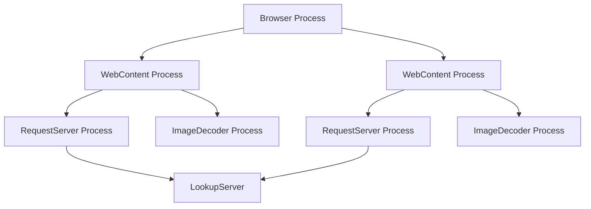

Ladybird Browser uses a multi-process architecture to improve stability and security when handling arbitrary and potentially hostile web content. This design isolates different concerns into separate processes with strict security boundaries.

<Note>
This document is partly aspirational - the codebase is actively being updated to fully implement this architecture.
</Note>

## Process overview

The Ladybird architecture consists of four main process types:



Every instance of the **Browser** application can have one or more tabs open. Each tab has a unique **WebContent** service process spawned on its behalf.

Two critical aspects of web browsing are further separated from the **WebContent** process:

- **Network requests**: Segregated to the RequestServer process
- **Image decoding**: Segregated to the ImageDecoder process

<Warning>
All processes are aggressively sandboxed using `pledge()` and `unveil()` mechanisms. All processes except Browser run as an unprivileged user, separate from the primary logged-in desktop user.
</Warning>

## WebContent process

The WebContent process is the heart of web rendering and execution.

### Responsibilities

- Hosts the main HTML/CSS engine (**LibWeb**)
- Runs JavaScript code via **LibJS**
- Receives input events from the Browser process
- Paints web content into shared bitmaps
- Communicates with the outside world only via RequestServer

### Security isolation

The WebContent process is heavily sandboxed:

- Cannot make direct network requests
- Cannot directly decode images
- Runs as an unprivileged user
- Has restricted file system access via `unveil()`
- Has restricted system call access via `pledge()`

<Info>
This isolation ensures that malicious web content cannot directly compromise the system, even if it exploits a vulnerability in LibWeb or LibJS.
</Info>

### LibWeb integration

Internally, the WebContent process contains:

- `WebContent::ConnectionFromClient`: IPC endpoint communicating with Browser
- `WebContent::PageHost`: Hosts the LibWeb engine's main `Web::Page` object
- `Web::Page`: Contains the main `Web::Frame` and potentially subframes
- `Web::Frame`: Contains a `Web::Document` (root of the DOM tree)

## RequestServer process

The RequestServer process handles all network operations on behalf of WebContent.

### Responsibilities

- Makes network requests using HTTP, HTTPS, and other protocols
- Downloads files from the internet
- Uploads data to remote servers
- Coordinates with LookupServer for DNS resolution

### Process model

Each **WebContent** process gets its own dedicated **RequestServer** instance. This provides:

- Process-level network isolation between tabs
- Independent network state per tab
- Ability to sandbox network access differently per origin

### DNS lookups

For DNS lookups, RequestServer communicates with the system's global **LookupServer** service, which handles all outgoing DNS requests for the entire system.

```bash
WebContent → RequestServer → LookupServer → DNS Server
```

## ImageDecoder process

The ImageDecoder process provides isolated image decoding capabilities.

### Responsibilities

Decodes various image formats into bitmaps:

- PNG
- JPEG
- BMP
- ICO
- PBM
- And more

### Security model

<Warning>
ImageDecoder processes are among the most heavily sandboxed components in Ladybird.
</Warning>

Each image is decoded in a **fresh ImageDecoder process**. These processes are:

- Strongly sandboxed with minimal system call access
- Cannot access the file system
- Can only receive encoded bitmap data via IPC
- Return decoded bitmap data to WebContent if successful
- Immediately terminated after decoding completes

<Tip>
By decoding each image in a fresh process, Ladybird ensures that exploits in image decoders cannot persist or affect other images.
</Tip>

## Process spawning mechanism

### WebContent spawning

To spawn a fresh **WebContent** process, clients connect to a Unix domain socket:

```bash
/tmp/session/%sid/portal/webcontent
```

Where `%sid` is the current login session ID.

- The socket is managed by **SystemServer**
- A new WebContent instance is spawned for every connection
- Only clients with suitable file system permissions can connect

### Helper process spawning

RequestServer and ImageDecoder processes follow a similar pattern:

- Spawned by **WebContent** as needed (not by Browser)
- Use dedicated socket paths for IPC
- Managed lifecycle tied to the spawning WebContent process

## Class architecture

The following diagram shows the main classes involved in the multi-process architecture:

### Browser process classes

```cpp
OutOfProcessWebView
  └── WebContentClient  // Implements client side of WebContent IPC
```

- `OutOfProcessWebView`: Widget placed in application windows
- Handles spawning all helper processes
- Manages IPC communication

### WebContent process classes

```cpp
WebContent::ConnectionFromClient  // Server side of WebContent IPC
  └── WebContent::PageHost
        └── Web::Page
              └── Web::Frame
                    └── Web::Document (DOM tree root)
```

<Info>
The `WebContentClient` in the Browser process speaks to `WebContent::ConnectionFromClient` in the WebContent process using a well-defined IPC protocol.
</Info>

## IPC communication patterns

### Browser ↔ WebContent

The Browser process communicates with WebContent for:

- **Input events**: Mouse, keyboard, touch events
- **Navigation**: URL loading, back/forward
- **Rendering**: Requesting paint updates
- **Output**: Receiving painted bitmaps to display

### WebContent ↔ RequestServer

WebContent requests network operations:

- **Resource loading**: HTML, CSS, JavaScript, images
- **XHR/Fetch**: AJAX requests from JavaScript
- **WebSocket**: Bidirectional communication

### WebContent ↔ ImageDecoder

WebContent sends encoded image data:

- **Decode request**: Raw image bytes with format hint
- **Decode response**: Decoded bitmap or error

## Security benefits

The multi-process architecture provides several security advantages:

<CardGroup cols={2}>
  <Card title="Fault isolation" icon="shield-halved">
    Crashes in one tab don't affect others or the main browser
  </Card>
  <Card title="Exploit mitigation" icon="lock">
    Exploits in rendering or JS execution run in sandboxed processes
  </Card>
  <Card title="Resource isolation" icon="box">
    Memory leaks or resource exhaustion contained per-tab
  </Card>
  <Card title="Privilege separation" icon="user-shield">
    Critical operations require crossing process boundaries
  </Card>
</CardGroup>

## Performance considerations

While the multi-process architecture provides security benefits, it also introduces overhead:

- **IPC latency**: Cross-process communication has overhead
- **Memory usage**: Each process has its own memory space
- **Process creation**: Spawning processes takes time

<Tip>
Ladybird balances these tradeoffs by reusing RequestServer processes per WebContent instance and using shared memory for large data transfers like bitmaps.
</Tip>

## Related documentation

<CardGroup cols={2}>
  <Card title="Architecture overview" href="/architecture/overview" icon="sitemap">
    High-level overview of Ladybird's architecture
  </Card>
  <Card title="Event loop" href="/architecture/event-loop" icon="rotate">
    Understanding LibCore's event system
  </Card>
</CardGroup>